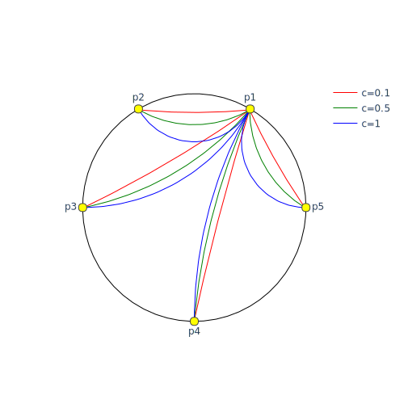
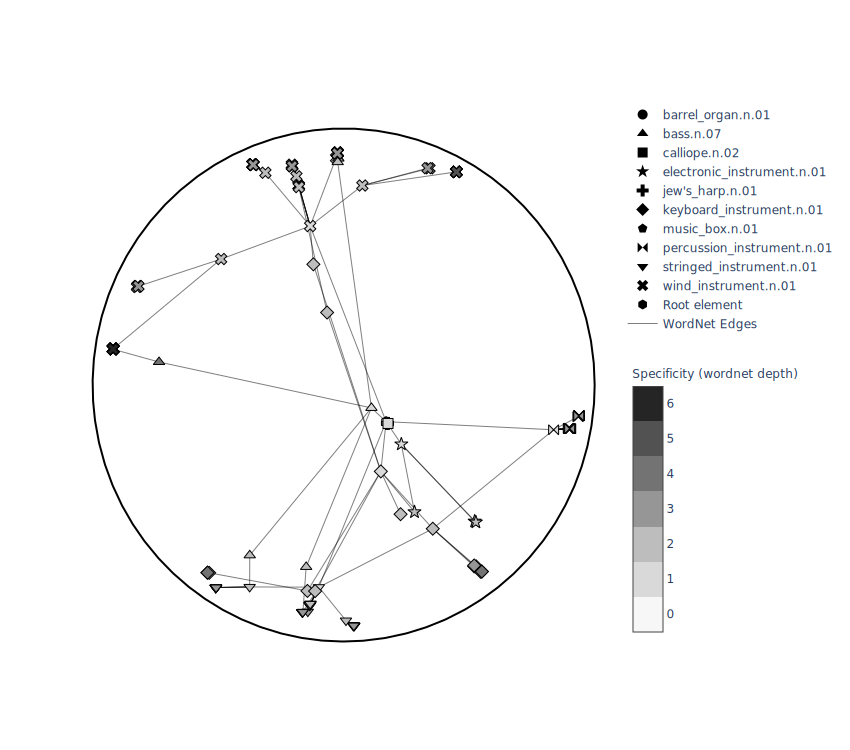

HierarX is a software aiming to build hyperbolic word representations.

Copyright (C) 2019 Solocal-SA and CNRS.

HierarX was developped by [François Torregrossa][1], Guillaume Gravier, Vincent Claveau, Nihel Kooli.

HierarX is published under the GNU AFFERO License, Version 3.0.

[1]: https://github.com/ftorregrossa

# HierarX

HierarX is a C++ implementation for learning hierarchical representation from similarities in hyperbolic manifolds (Poincaré or Lorentz). The optimisation process follows [Nickel and Dioula](https://arxiv.org/pdf/1806.03417.pdf).

It comes with its python package: pyhierarx. This one aims to help with the drawing and exploitation of HierarX embeddings.


## Contents

* [Pictures](#pictures)
* [Resources](#resources)
   * [Articles](#articles)
   * [Existing Implementations](#existing-implementations)
* [Motivation](#motivation)
* [Requirements](#requirements)
* [Installation](#installation)
   * [Build C++ binary](#build-c-binary)
   * [Install python package](#install-python-package)
* [Usage C++](#usage-c)
   * [Learn Continuous Hierarchies](#learn-continuous-hierarchies)
      * [Input: Word Embedding](#input-word-embeddings)
      * [Input: Similarity Matrix](#input-similarity-matrix)
   * [Convert binary output file to .vec format](#convert-binary-output-file-to-vec-format)
* [Examples](#examples)
   * [Discover hierarchies from similarities](#discover-hierarchies-from-similarities)
* [Contributing](#contributing)
* [License](#license)

## Pictures

Geodesics in the Poincaré disk model (with different value of celerity):


Embedding of wordnet instrument in the Poincaré disk:


## Resources

### Articles
- Continuous Hierarchies from similarities: [Space-Time Local Embeddings](https://papers.nips.cc/paper/5971-space-time-local-embeddings.pdf) and [Learning Continuous Hierarchies in the Lorentz Model of Hyperbolic Geometry](https://arxiv.org/pdf/1806.03417.pdf).
- Hyperbolic embeddings from plain-text: [Poincaré Glove : Hyperbolic Word Embeddings](https://arxiv.org/pdf/1810.06546.pdf) and [Skip-gram Word Embeddings in Hyperbolic Space](https://arxiv.org/pdf/1809.01498.pdf).
- Continuous Hierarchies from knowledge graph: [Poincaré Embeddings for Learning Hierarchical Representations](https://arxiv.org/pdf/1705.08039.pdf)
- [Hyperbolic Deep Neural Networks](https://papers.nips.cc/paper/7780-hyperbolic-neural-networks.pdf)

### Existing Implementations
- Pytorch implementation of hyperbolic manifolds: [geoopt](https://github.com/geoopt/geoopt)
- Pytorch implementation of [Poincaré Embeddings for Learning Hierarchical Representations](https://arxiv.org/pdf/1705.08039.pdf) : [poincare-embeddings](https://github.com/facebookresearch/poincare-embeddings)

## Motivation

This implementation fills two objectives:

- Efficiently compute hierarchies from similarities in hyperbolic spaces.
- Convert euclidean embeddings to hyperbolic spaces. Therefore, it reduces the dimensionality of euclidean embeddings while keeping decent performances and discovering hierarchies.

## Requirements

HierarX compiles on any OS (MacOS, Linux, Windows). It requires [annoy](https://github.com/spotify/annoy) and [argh](https://github.com/adishavit/argh) github projects.

## Installation

### Build C++ binary
It requires cmake >= 3.14 and gcc or clang.

```bash
# Clone HierarX
git clone https://github.com/ftorregrossa/HierarX
cd HierarX

# Setup dependencies
git submodule update --init --recursive
export ANNOY_HOME=${PWD}/third_party/annoy
export ARGH_HOME=${PWD}/third_party/argh

cd HierarX/build
cmake ..
make HierarX
```

### Install python package
HierarX comes with its python package: pyhierarx.

From root project directory, execute following instructions to complete the installation: 
```bash
pip install -r pyhierarx/requirements.txt
pip install .
```

## Usage C++

### Learn continuous hierarchies

Input for learning continuous hierarchies are either a word embedding or a similarity matrix.

#### Input: Word Embeddings

The format must be a .vec (GloVe):
```txt
N F
WORD_1 DIM_1 DIM_2 ... DIM_F
WORD_2 DIM_1 DIM_2 ... DIM_F
.
.
.
WORD_N DIM_1 DIM_2 ... DIM_F
```

 An example for a word embedding containing 5 words with 2 dimensions:
```txt
5 2
hierarx 0.37961 0.52684
learns 0.25774 0.52448
hyperbolic 0.09547 0.51548
word 0.093367 0.47123
representations 0.1313 1.0844
```

Hierarx uses the dot product between word vectors to estimate similarity between words. If you want to use cosine similarity instead then you must normalise the word vectors of the .vec file.

To start learning use the following command:
```
HierarX \
-dim=10 \
-nvoc=1000 \
-thread=8 \
-expdir=/path/to/experiment/directory \
-input=/path/to/embedding.vec \
-hmode=Poincaré \
-niter=1000000 \
-lr=0.01 \
-momentum=0.9 \
--nesterov
```

This will learn a continuous hierarchical representations using embedding.vec (-input) in the Poincaré ball (-hmode) of dimension 10 (-dim). Only the first 1000 words (-nvoc) of embedding.vec would be considered. The training will be dispatched on 8 thread (-nthread), with a learning rate equal to 0.01 (-lr), and a momentum equal to 0.9 (-momentum). The nesterov version of SGD will be used (--nesterov). The number of batches is fixed to 1000000 (-niter) and the resulting embedding are stored in /path/to/experiment/directory (-expdir).

Other parameters are available and can be listed using the help flag:
```
HierarX --help
>>>HierarX: Learn hyperbolic embeddings based on multi-source similarities.
   
   required parameters (type):
   	-nvoc (integer): number of word in hyperbolic vocabulary (taking nvoc most frequent word in -input for similarity files).
   	-dim (integer): dimension of hyperbolic embedding.
   	-thread (integer): number of thread concurrently working.
   	-input (string): path to source embedding (.vec (GloVe) format or specify similarity for (h,t,score)).
   	-expdir (string): experiment directory (where hyperbolic and other files might be written)
   
   optional parameters (type, default value):
   	-lr (float, 0.01): opt learning rate (sgd).
   	--similarity (flag): input format is similarity couples.
   	--nesterov (flag): activate nesterov optimization. (default false)
   	-momentum (float, 0.9): momentum (sgd).
   	-bs (integer, 10): number of main word in batch.
   	-sampling (integer, 20): number of word to sample for each main word.
   	-posthres (float, 0.1): between 0-1, proportion of positive example to introduce in samples (based on annoy tree).
   	--continue training (loading from expdir).
   	-plateau (float, 0.10): percentage of niter with lr / 10.
   	-c (float, 1): celerity of the hyperbolic model (Lorentz/Poincaré, in [0, +inf].
   	-hmode={'Poincare', 'PoincareStack', 'Lorentz'} : Manifold.
```

If HierarX stops for any reason it is possible to pursue training with the flag --continue. This flag indicates to HierarX that it has to load the hyperbolic embedding and momentum stored in the experiment directory. A backup is automatically done each 10000 iterations. You can change the backup rate by modifying the preprocessed variable CHECKPOINT in src/UserInterface.cpp.

-sampling controls the size of the batches. Each element in a batch is composed of a target word and N randomly selected words (N being fixed by -bs).

The vocabulary being large in some cases, batch are composed of irrelevant words with regards to the target word. In other words, words are likely to be totally not related to the target word. Therefore the -sampling value must be big enough with regard to the size of the vocabulary. In order to create more relevant batches we introduce the notion of positive sampling : words in the neighborhood of the target words are more likely to be selected than others (that's why annoy is needed). The argument -posthres controls the percentage of these words introduced in the batch. For instance a value  equal to 0.10 means that 10% of the batch is made with words in the neighborhood of the target word. By default HierarX takes random words in the 100 closest words. This value is controlled by the preprocessing variable SEARCH_K in src/VecBinder.cpp. 

A really important variable is -plateau (by default fixed to 0.10). It controls the percentage of iterations with a learning equal to 10% of the learning rate set by -lr. For example, -plateau=0.10 -niter=1000 means that the first 100 iterations would have a lower learning rate. This is done to promote angular relations instead of magnitude relations, as explained in [Poincaré Embeddings for Learning Hierarchical Representations](https://arxiv.org/pdf/1705.08039.pdf).

-hmode sets the hyperbolic manifold: Poincare, Lorentz or PoincareStack.

On very small dataset (small vocabularies), collisions between thread happen a lot. In order to avoid that, one may use one thread.

On very big dataset (large vocabularies), one may use as many thread as possible.

Finally, -c controls the curvature of the hyperbolic manifold. Values close to 0 are almost euclidean while large values produces really curved manifolds. We followed [Hyperbolic Deep Neural Networks](https://papers.nips.cc/paper/7780-hyperbolic-neural-networks.pdf) for this aspect.

#### Input: Similarity Matrix

Hierarx reads similarity matrices in the following format:

```txt
word1,word2,score
...
```

For instance :
```txt
Left,signals,3.395642042160034
coaches,Todd,4.5020647048950195
Todd,aware,2.446413040161133
aware,signals,4.765902042388916
```

--similarity flag is used to indicate that the input is a similarity file. By default, similarity pairs are considered asymmetric score(x,y) != score(y, x). The flag --symmetric is used to have symmetric scores (symmetric pairs are then generated).

An example would be:
```
HierarX \
-dim=10 \
-nvoc=1000 \
-thread=8 \
-expdir=/path/to/experiment/directory \
-input=/path/to/similarity.csv \
-hmode=Poincaré \
-niter=1000000 \
-lr=0.01 \
-momentum=0.9 \
--nesterov \
--similarity
```

To learn about parameters please see section on [Input : Embeddings](#input-word-embeddings).

### Convert binary output file to .vec format

HierarX produces .bin files in the experiment directory. We propose a converter that turns this .bin into a .vec (GloVe) format.

To do so:

```
HierarX --convert \
-embedding=/path/to/experiment/directory/embedding.bin \
-opath=/any/where/embedding.vec
```

If your embedding uses the Lorentz Manifold, it is possible to turn it into a Poincaré manifold with the --poincare flag. It uses the diffeomorphism defined by [Nickel and Dioula](https://arxiv.org/pdf/1806.03417.pdf).


## Examples

### Discover hierarchies from similarities

In the demo directory of the project we show an example on wordnet.

We extract all hyponyms of an entity in wordnet, and extract the subgraph composed by those entities. Then, we compute similarities.

Similarities are fed into hierarx (.hierarx file), in order to reconstruct the hierarchy.

At the end of the demo, a chart and an animation (on training phase) are produced.


To produce the musical instruments hierarchy (see [Pictures](#pictures)), do the following:

```
export HIERARX_BIN=/path/to/build/dir/HierarX
cd demo
./train-wordnet musical_instrument.n.01
```

It is possible to compute other hierarchy in wordnet:
```
./train-wordnet mammal.n.01
```

## Contributing

HierarX is still in development. 

If anything wrong cross your path while using it, please raise an issue or propose a fix.

If any idea cross your mind related to hyperbolic word embeddings, please propose a pull request with a detailed explanations.

Please respect the shape of implementation.

You can propose to add your own examples in this readme.

## License

HierarX is free software: you can redistribute it and/or modify
it under the terms of the GNU Affero General Public License as published by
the Free Software Foundation, either version 3 of the License, or
(at your option) any later version.

This program is distributed in the hope that it will be useful,
but WITHOUT ANY WARRANTY; without even the implied warranty of
MERCHANTABILITY or FITNESS FOR A PARTICULAR PURPOSE.  See the
GNU Affero General Public License for more details.

You should have received a copy of the GNU Affero General Public License
along with this program.  If not, see <https://www.gnu.org/licenses/>.

If you use this software please cite : 
```bib
@inproceedings{hierarx,
  author       = {Torregrossa, François and Gravier, Guillaume and Claveau, Vincent and Kooli, Nihel},
  title        = {HierarX : un outil pour la découverte de hiérarchies dans des espaces hyperboliques à partir de similarités},
  date         = {2020},
  booktitle    = {Accepted at EGC 2020}
}
```

Contact: ftorregrossa@solocal.com, francois.torregrossa@irisa.fr
